<div align="center">

# XINGXIXIA / 研究档案

**算法 · 机器人 · 论文阅读 · AI 工具**

这里会慢慢整理我的学习记录、实验轨迹、论文笔记，以及把想法做成可运行工具的过程。

<br />


[](https://github.com/xingxixia)


</div>

## 工具箱

<p align="center">
  
  
  
  
  
  
  
</p>

```text
> 主要语言      : Python / C++
> 机器人栈      : ROS / Linux
> 记录方式      : Markdown notes
```

---

## GitHub 信号

<div align="center">




</div>

---

## 活动轨迹

<div align="center">

[](https://github.com/Ashutosh00710/github-readme-activity-graph)

</div>

---

## 贡献贪吃蛇

<div align="center">

<picture>
  <source media="(prefers-color-scheme: dark)" srcset="https://raw.githubusercontent.com/xingxixia/xingxixia/output/github-contribution-grid-snake-dark.svg" />
  <source media="(prefers-color-scheme: light)" srcset="https://raw.githubusercontent.com/xingxixia/xingxixia/output/github-contribution-grid-snake.svg" />
  
</picture>

</div>
